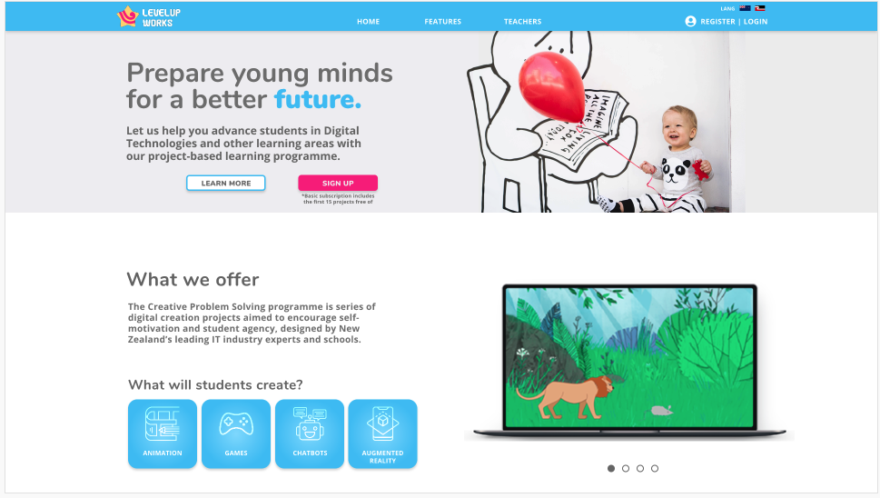

# Level Up Website 




## Overview 

Teaming up with the developers at the last mission at Mission Ready’s Full Stack Developer’s course, we developed an educational website for primary and intermediate schools. The Level Up Website allows teachers to track the progress of their students and students to submit their projects.


## Features

- Teachers can track the progress of their students.
- Students can submit their projects.
- Interactive dashboard for students and teachers.
- User authentication and authorization.
- Database to store user information and project data.

## Technologies Used

- Javascript
- React
- Node.js
- Express
- MySQL 

## Project Structure

- `/frontend`: Contains the React frontend code.
- `/backend`: Includes the Node.js backend code. 


## Getting Started 

### Installation and Deployment

1. Clone the repository and navigate to the project's root directory.

2. Install dependencies for both frontend and backend:
    ```bash   
    cd frontend
    npm install
    cd ../backend
    npm install
    ```

3. Set up the MySQL database:
   Create a MySQL database and update the db-config.js file in the backend folder with your database credentials.


4. Start the development servers:
    ```bash
    cd frontend
    npm start
    cd ../backend
    node server
    ```

## Contact

For any inquiries, you can reach me at audwns39@hotmail.com 